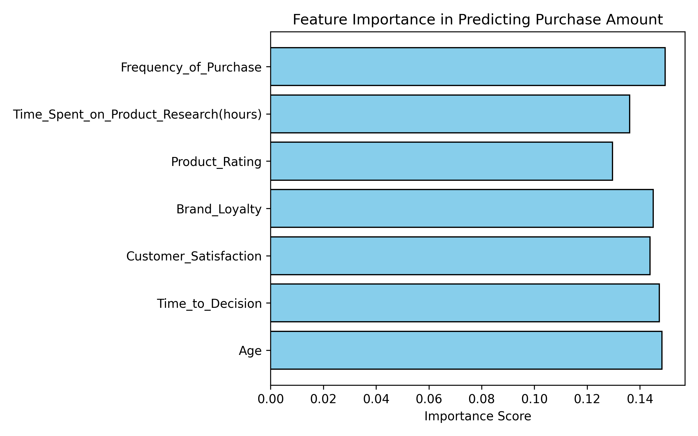

[](https://github.com/josephong610/JDS706_DE_Wk1.2/actions/workflows/main.yml)

# JDS706_DE_Wk1.2

## Project Goal and Real-World Relevance
The goal of this assignment is to analyze Ecommerce Consumer Behavior data and predict purchase amounts using customer features such as **age, gender, income level, education, satisfaction, loyalty, and time to decision**.  

Predicting purchase amounts has direct real-world relevance since:
- **E-commerce platforms** can use it to optimize personalized recommendations.  
- **Marketing teams** can better allocate resources to high-value customer segments.  
- **Customer analytics** can identify trends in impulsive vs. planned purchases.  

By modeling consumer behavior, businesses can uncover insights into what drives higher spending and which factors matter most for purchase decisions.

---

## Data Source and Structure
The dataset (`Ecommerce_Consumer_Behavior_Analysis_Data.csv`) contains a collection of consumer behavior features, like demographics, purchase behavior, satisfaction ratings, loyalty indicators, and decision-making metrics. The table below shows an example of what the columns look like. (Although there are more columns in the actual file)

The website link to the Kaggle dataset is here: https://www.kaggle.com/datasets/salahuddinahmedshuvo/ecommerce-consumer-behavior-analysis-data

### Example of Dataset Structure

| Customer_ID | Age | Gender | Income_Level | Education_Level | Purchase_Amount | Purchase_Intent | Time_to_Decision | Customer_Satisfaction |
|-------------|-----|--------|--------------|----------------|-----------------|-----------------|------------------|-----------------------|
| 1001        | 25  | Male   | Low          | High School    | 120.50          | Impulsive       | 2                | 8                     |
| 1002        | 34  | Female | Middle       | Bachelor's     | 340.00          | Planned         | 5                | 9                     |
| 1003        | 42  | Male   | High         | Master's       | 580.75          | Needs-based     | 7                | 7                     |

---

## Data Cleaning and Preprocessing
Before modeling, several steps were taken to ensure that the data quality was good:

1. **Cleaning purchase amounts**  
   - Removed `$` symbols and commas.  
   - Converted values to numeric floats for analysis.  

2. **Handling missing values**  
   - Filled `Engagement_with_Ads` and `Social_Media_Influence` missing values with `"No engagement"`.  

3. **Removing duplicates**  
   - All duplicate rows were dropped from the dataset.  

4. **Outlier handling**  
   - Winsorized numeric columns (`Purchase_Amount`, `Age`, `Time_to_Decision`, `Customer_Satisfaction`, `Product_Rating`, `Time_Spent_on_Product_Research(hours)`, `Frequency_of_Purchase`) at the **1st and 99th percentiles** to reduce the influence of extreme values.  

These steps ensured that the machine learning model was trained on clean and stable data. Otherwise the xgboost algorithm may not be as accurate as we want it to be.

---

## Grouped Summary Statistics
To better understand the dataset, grouped summaries were computed by demographic and behavioral categories (Gender, Income Level, Education Level):

- **Mean and Median Time to Decision**  
- **Average Purchase Amount**  
- **Counts of Engagement with Ads**  
- **Number of Customers per Group**

This gave us insight into how spending and decision-making vary across different demographic groups. This table can be found by running (`data.py`).

---

## Machine Learning Model
We trained an **XGBoost Regressor** to predict purchase amounts. Features used included:

- `Age`  
- `Time_to_Decision`  
- `Customer_Satisfaction`  
- `Brand_Loyalty`  
- `Product_Rating`  
- `Time_Spent_on_Product_Research(hours)`  
- `Frequency_of_Purchase`  

### Model Metrics
After splitting the data (80% train, 20% test), we evaluated performance:

- **MSE:** `23649.48`  
- **RMSE:** `153.78`  
- **R²:** `-0.36`  

🔎 **Interpretation:**  
- The RMSE of ~154 means that predictions are, on average, off by about $154 from the true purchase amounts so there can still be a lot of improvement to the model. And unfortunately, the high MSE shows that our model is not really good for predicting the prices. Perhaps the explanatory variabels I picked are not very informative of the prices.
- The negative R² indicates that the model currently performs worse than a simple baseline (predicting the mean purchase amount for everyone).

This highlights the challenge of predicting spending behavior. If I were to continue working on this analysis, then I would need additional explanatory variables or look for a different method to answer this question.

---

## Visualizations
Several visualizations were generated to evaluate the model and interpret results:

1. **Scatter Plot of Actual vs. Predicted Values**  
     
   - Shows where predictions deviate from the 1:1 line.  
   - Unfortunately shows that predictions often miss actual values by a wide margin.  

2. **Feature Importance Bar Chart**  
     
   - Indicates which features had the most influence.  
   - `Age` and `Frequency of Purchase` seems to be the most important here.

3. **Error Distribution Histogram**  
     
   - Plots the distribution of `(Actual – Predicted)` errors.  
   - Errors center near 0 but is very wide, so it unfortunately shows some poor model accuracy.  

4. **Residual Plot**  
     
   - Residuals vs. Predicted values.  
   - There were no clear linear trend, but very high variance across the prediction range.  

5. **Average Actual vs Predicted by Age Group**  
     
   - Groups customers into age bands (`<25`, `25-35`, `35-50`, `50-65`).  
   - Shows that the model consistently underestimates purchase amounts across most age groups. I am showing the 50-65 age group to show that there are no people in that age group in my dataset.  
   - The discrepancy is largest in the **25–35 group**, where predicted averages are well below actual averages.  

These plots show that while some signal exists in the data, the model still struggles to generalize.

---

## Results and Discussion
- **Feature importance** suggests that **age and frequency of purchase** are the strongest predictors of spending.  
- **Product Rating** mattered less than expected, which might indicate non-linear relationships.  
- **Model accuracy was poor**, showing the difficulty of predicting purchase amounts with only demographic and decision-related features.  
- Future improvements could include:
  - Adding more features (engagement, loyalty, ad influence).  
  - Trying alternative models (Random Forest, Neural Nets).  
  - Hyperparameter tuning of XGBoost.  

---

## Environment Setup with Docker
This project is **fully containerized** using Docker to ensure reproducibility.

### Step 1: Clone the repository
```bash
git clone https://github.com/josephong610/JDS706_DE_Wk1.2.git
cd JDS706_DE_Wk1.2
```

### Step 2: Build the Docker image
```bash
docker build -t jds706_project .
```

### Step 3: Run the container
```bash
docker run --rm jds706_project
```

---

## Dockerfile
The `Dockerfile` ensures that dependencies and scripts are reproducible across systems.

```dockerfile
FROM python:3.12-slim
WORKDIR /app
COPY requirements.txt .
RUN pip install --no-cache-dir -r requirements.txt
COPY . .
CMD ["pytest", "--maxfail=1", "--disable-warnings", "-q"]
```

---

## Running Tests
Tests in `data_test.py` validate:
- Dataset loads correctly and required columns exist.  
- Purchase amounts are cleaned and numeric.  
- Grouped summaries produce correct aggregates.  
- XGBoost trains and returns predictions of correct shape.  
- Performance metrics (MSE, R²) are valid.  
- Edge cases (empty dataset) don’t break the pipeline.  

Run tests locally:
```bash
make test
```

Or in Docker:
```bash
make docker-test
```

---

## Project Structure
These are the most important files that you will need in this repository.
```
.
├── data.py                 # Main analysis (cleaning, modeling, visualization)
├── data_test.py            # Test suite for validation
├── requirements.txt        # Dependencies
├── Dockerfile              # Containerized environment
├── Makefile                # Local + Docker workflows
├── README.md               # Project documentation
└── Ecommerce_Consumer_Behavior_Analysis_Data.csv
```

---

## Makefile Usage
For convenience, the project includes a Makefile:

- **Local workflow**:
  ```bash
  make all
  ```
  Runs install, format, lint, test, clean.

- **Docker workflow**:
  ```bash
  make docker-all
  ```
  Builds the image, lints, formats, tests, and cleans inside Docker.

---

## Refactoring
For the refactoring aspect, the first versions of the (`data.py`) mixed data cleaning, feature engineering, and modeling in long code blocks. I broke them down to functions with clearly defined responsibilities (e.g., cleaning, grouping, training, evaluation) so that it looks cleaner and can be called at any time. I also renamed variables like "df" to be "consumer_df" so that it's more descriptive and future users can know what the df holds. The **Makefile** was also expanded to standardize workflows for both local and Docker environments. Further, redundant code in tests was either deleted or put into functions so that the code looks cleaner.


## Requirements for this assignment
I made sure to include the CI integration (although it was implemented previously as well), refactored my code in both the (`data.py`) and the (`data_test.py`) files. I also used black for formatting and flake8 for linting in the Makefile. I also increased the number of explanatory variables that I am looking at for this assignment to enhance my ML procedure.

## Screenshots
     
   - This was before refactoring and there were no helper functions in the beginning. Also my code is pretty long so I only took a screen shot of the first 50 lines but you can see the changes even from the screenshots.

     
   - This was after refactoring and you can see that it's organized into functions that have clearly defined roles.

     
   - This shows that the CI workflow is running successfully.

## Conclusion
This project demonstrated the full pipeline of:
- Cleaning and preprocessing messy real-world data.  
- Handling missing values and outliers.  
- Training and evaluating a machine learning model.  
- Visualizing results to diagnose weaknesses.  
- Ensuring reproducibility via **Docker + Makefile**.  

While the model currently underperforms, the infrastructure (cleaning, testing, reproducibility) provides a strong foundation for **iterative improvement and experimentation**.
